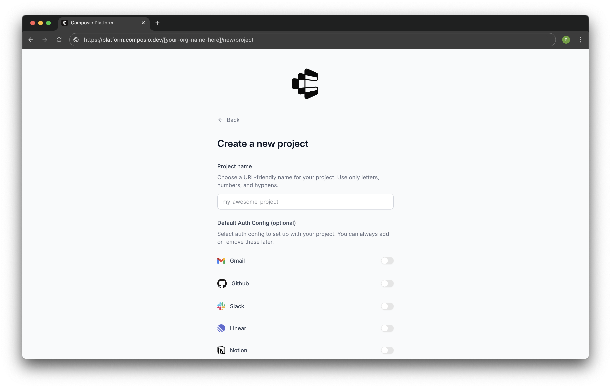
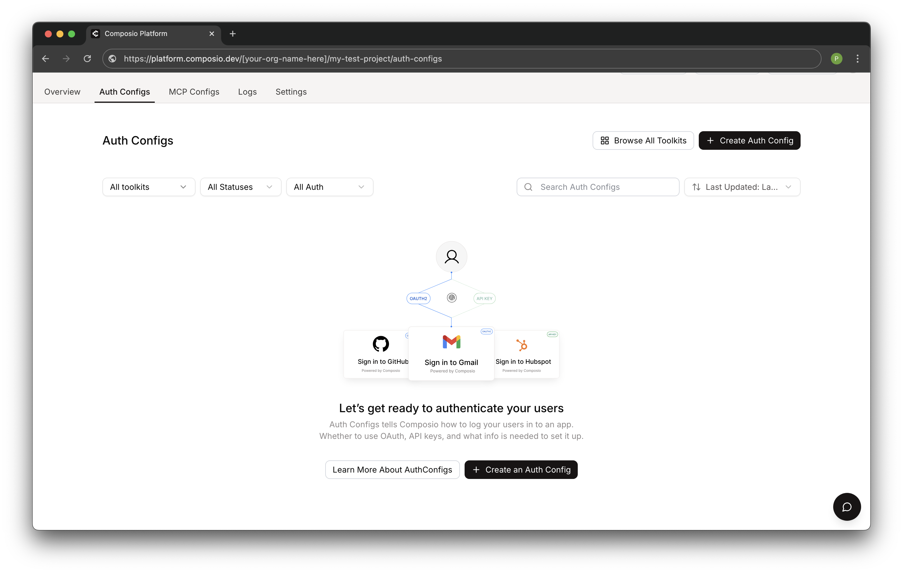
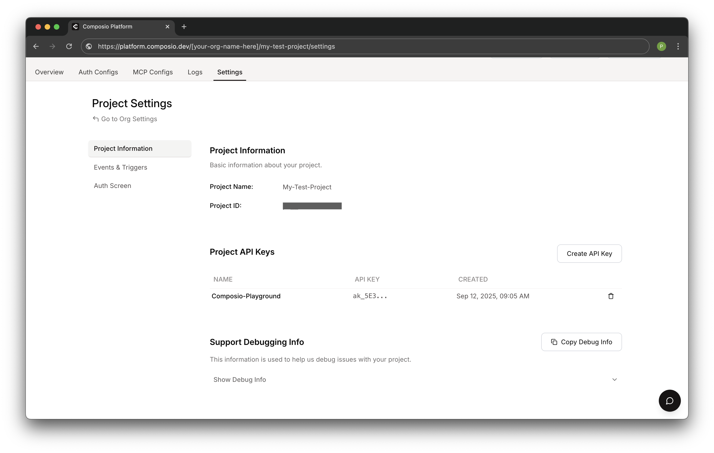

# Composio Integration for AI Agents

## About Composio

Composio provides your AI agents with 350+ pre-built tool integrations. It handles authentication and connects your agents to external services like CRMs, productivity tools, and social media platforms.

## Available Toolkits

This example uses the HackerNews toolkit, but Composio offers many more, including:
- CRM systems (Salesforce, HubSpot)
- Productivity tools (Google Workspace, Microsoft 365)
- Social media (Twitter, LinkedIn)
- Development tools (GitHub, Jira)

## Setup Instructions

1. **Create a Composio Account**
   
   Sign up for a free account at [composio.dev](https://composio.dev)

2. **Create a New Project**
   
   Navigate to your Composio dashboard and create a new project:
   
   
   
   Give your project a name. You can optionally enable popular tools like Gmail, GitHub, or Slack at this point.

3. **Add Tools to Your Project**
   
   In your project, navigate to the "Auth Configs" tab to add tools and integrations:
   
   
   
   Click "Create Auth Config" or "Browse All Toolkits" to add tools to your project. For this example, we're using the HackerNews toolkit (which doesn't require authentication).

4. **Get Your API Key**
   
   In your project settings, locate your API key:
   
   
   
   Copy the API key and add it to your `.env` file:
   ```
   COMPOSIO_API_KEY=your-api-key-here
   ```
   
   Alternatively, you can set it for your project from the command line, before you (re)deploy the Kitchen Sink project:
   ```bash
   agentuity env set --secret COMPOSIO_API_KEY your-api-key-here
   ```

5. **Test the Integration**
   
   Send a message to the `example-composio` agent asking about HackerNews posts.

## Learn More
Check out our video tutorial:
- [Composio integration demo](https://youtu.be/WUkB9jjqV_4?t=187) showing a practical example with Agentuity agents.
