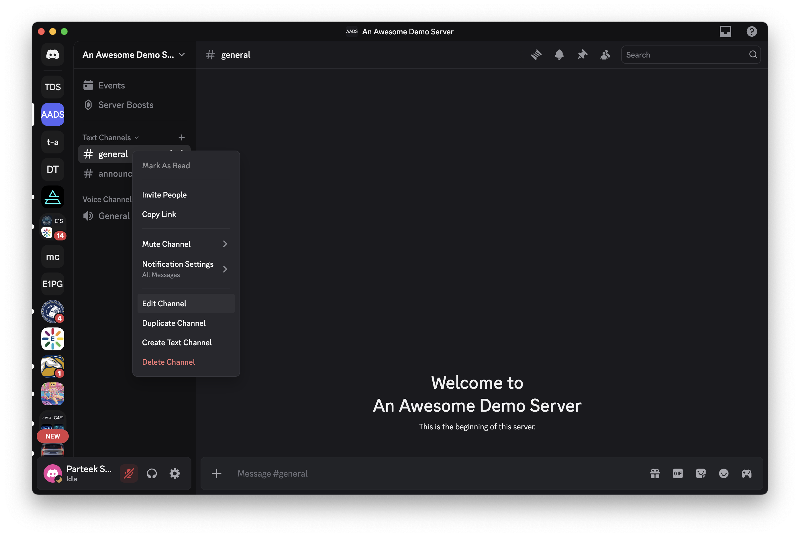
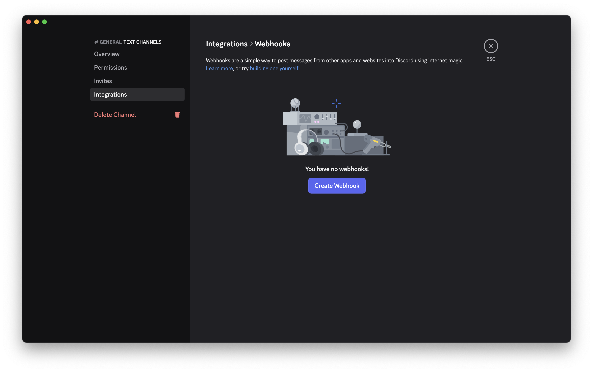
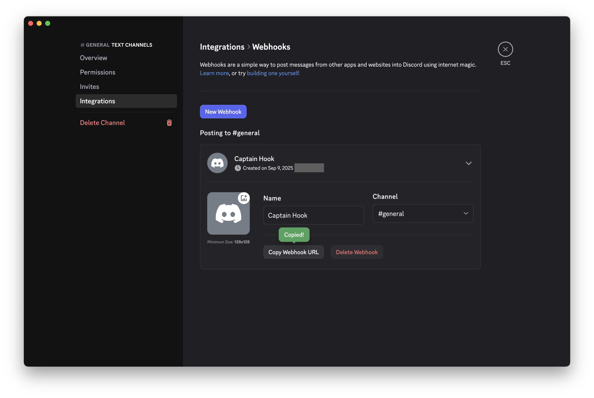

# Discord Webhook Integration

## Setup Instructions

1. **Create a Discord Webhook**
   
   Right-click on the Discord channel where you want to receive notifications and select **Edit Channel**:
   
   
   
   Navigate to **Integrations** in the left sidebar, then click on **Webhooks**. You'll see the webhooks page:
   
   
   
   Click **Create Webhook** and configure your webhook:
   - Give it any name you like (this is just for your reference in Discord settings)
   - Select the channel for notifications
   - Click **Copy Webhook URL**
   
   > **Note**: The bot name that appears in Discord messages is set by the agent code as "Agentuity Agent", regardless of what you name the webhook here.
   
   

   > **Alternative Method**: You can also access webhooks via Server Settings → Integrations → Webhooks

2. **Configure Environment Variable**
   
   For local development, add to your `.env` file:
   ```
   DISCORD_WEBHOOK_URL=https://discord.com/api/webhooks/YOUR_WEBHOOK_ID/YOUR_WEBHOOK_TOKEN
   ```
   
   For production deployment:
   ```bash
   agentuity env set --secret DISCORD_WEBHOOK_URL your-webhook-url-here
   ```

3. **Test the Integration**
   - Send JSON event data to your agent
   - Check your Discord channel for the sample notification

## Example Usage

This agent accepts any JSON payload and uses an LLM to create Discord notifications.

### Sample Event Data

```json
{
  "type": "demo_published",
  "title": "How to Schedule Your AI Agents with Cron Jobs",
  "description": "Learn about scheduling agents with cron jobs",
  "url": "https://www.youtube.com/watch?v=__m9SnhJXVM",
  "platform": "YouTube"
}
```

## Security Note

Never commit your webhook URL to version control. Always use environment variables to store sensitive configuration.