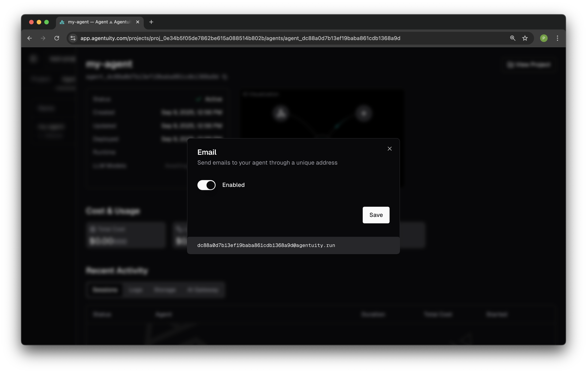

# Email Configuration

Agents in Agentuity can receive and send emails. This example demonstrates outbound email functionality.

## Setup Instructions

1. **Configure Email Recipients**
   
   In the Agentuity web console, navigate to your agent's IO settings (outbound side) and click on Email:
   
   
   
   Add one or more recipient email addresses in the "To" field. Separate multiple addresses with commas.
   
   > **Note:** Recipients and subject lines are currently configured through the Agentuity web console only, not via code.

2. **Choose a Sender Address**
   
   You can send emails to multiple recipients simultaneously once connected.
   
   By default, emails are sent from `no-reply@agentuity.run`. This works immediately without any additional setup.

3. **Optional: Agent-Specific Sender Address**
   
   To use an agent-specific sender address, enable inbound email for your agent:
   
   
   
   Once enabled, your agent receives a unique email address (based on its unique agent ID) that can also be used as the sender address for outbound emails:

   

4. **Test the Integration**
   
   Use the pre-set commands to test email sending:
   - **Send Basic Email**: Tests plain text email delivery
   - **Send HTML Email**: Tests HTML-formatted email with styling

## Deployment Required for IO Features

Once you complete the steps above, deploy the Kitchen Sink project:

```bash
agentuity deploy
```

Once deployed, you can test IO operations from DevMode using the agent's webhook endpoint.

## How Email Sending Works

This agent uses a self-webhook pattern to enable email sending from DevMode:

- **Before deployment**: You can test commands in DevMode, but actual email sending requires deploying the agent first.

- **After deployment with email configured**: When you click a command in DevMode, the agent detects the manual trigger and calls its own webhook endpoint, which then sends the actual email to your configured recipients. You'll see a success message in DevMode AND receive the email.

## Learn More
Check out our video tutorials:
- [Demo video](https://youtu.be/X-HEUFH5C0Y) of an agent sending HTML emails
- [Technical walkthrough](https://youtu.be/itDn6BAFNL0) covering email features and capabilities in Agentuity
