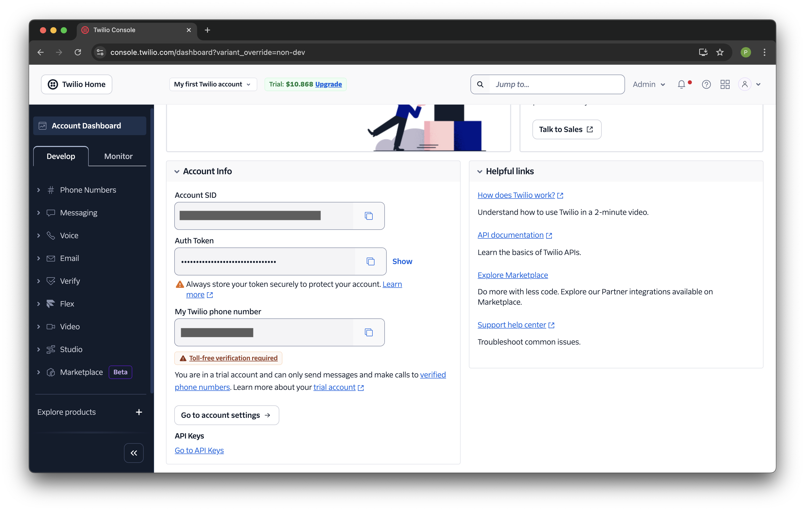
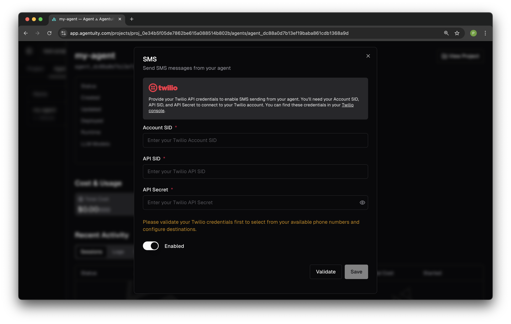

# SMS Configuration with Twilio

Agents in Agentuity can receive and send SMS messages. This example demonstrates outbound SMS functionality.

## Setup Instructions

1. **Create a Twilio Account**
   
   Sign up for a free trial account at [twilio.com](https://www.twilio.com). Trial accounts include free credits for testing SMS functionality.

2. **Get Your Twilio Credentials**
   
   From your [Twilio Console Dashboard](https://console.twilio.com), locate your Account Info:
   
   
   
   You'll need:
   - **Account SID**: Your unique account identifier
   - **API SID**: Your Twilio API SID (create one in the API Keys section)
   - **API Secret**: Your Twilio API Secret (shown only when creating the API key)
   
   > **Important:** When creating an API key in Twilio, the secret is only shown once. Save it immediately - you won't be able to view it again in the API Keys section.

3. **Configure SMS in Agentuity**
   
   In the Agentuity web console, navigate to your agent's IO settings and click on SMS:
   
   
   
   Enter your Twilio credentials:
   - Account SID
   - API SID
   - API Secret
   
   Click **Validate** to verify your credentials, then **Save**.

4. **Test the Integration**
   
   Send the "Send Basic SMS" command to your agent. The SMS will be sent from your Twilio phone number.

## Deployment Required for IO Features

Once you complete the steps above, deploy the Kitchen Sink project:

```bash
agentuity deploy
```

Once deployed, you can test IO operations from DevMode using the agent's webhook endpoint.

## How SMS Sending Works

This agent uses a self-webhook pattern to enable SMS sending from DevMode:

- **Before deployment**: You can test commands in DevMode, but actual SMS sending requires deploying the agent first.

- **After deployment with SMS configured**: When you click a command in DevMode, the agent detects the manual trigger and calls its own webhook endpoint, which then sends the actual SMS to your configured phone number. You'll see a success message in DevMode *and* receive the SMS.

## Important Notes

- **Sending Number**: Toll-free numbers require verification before they can send SMS. For easier setup, purchase a regular local number instead. Go to **Phone Numbers > Manage > Buy a number** in your Twilio console.
- **Recipient Number(s)**: With a Twilio trial account, you can only send SMS to verified recipient numbers. Add them in **Phone Numbers > Manage > Verified** in your Twilio console.
- **Phone Number Format**: Use international format (e.g., +12345678901)
